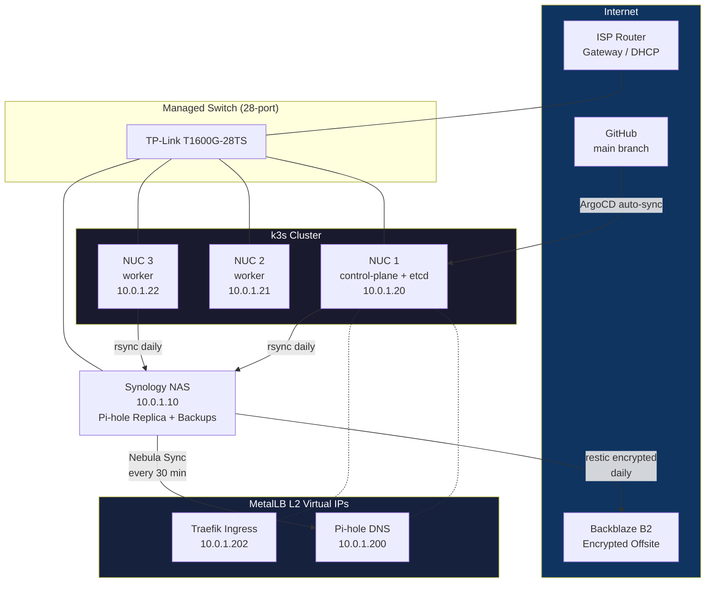
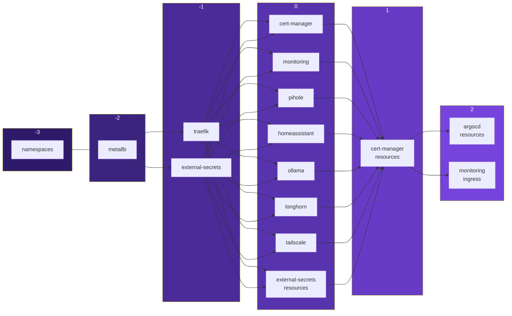
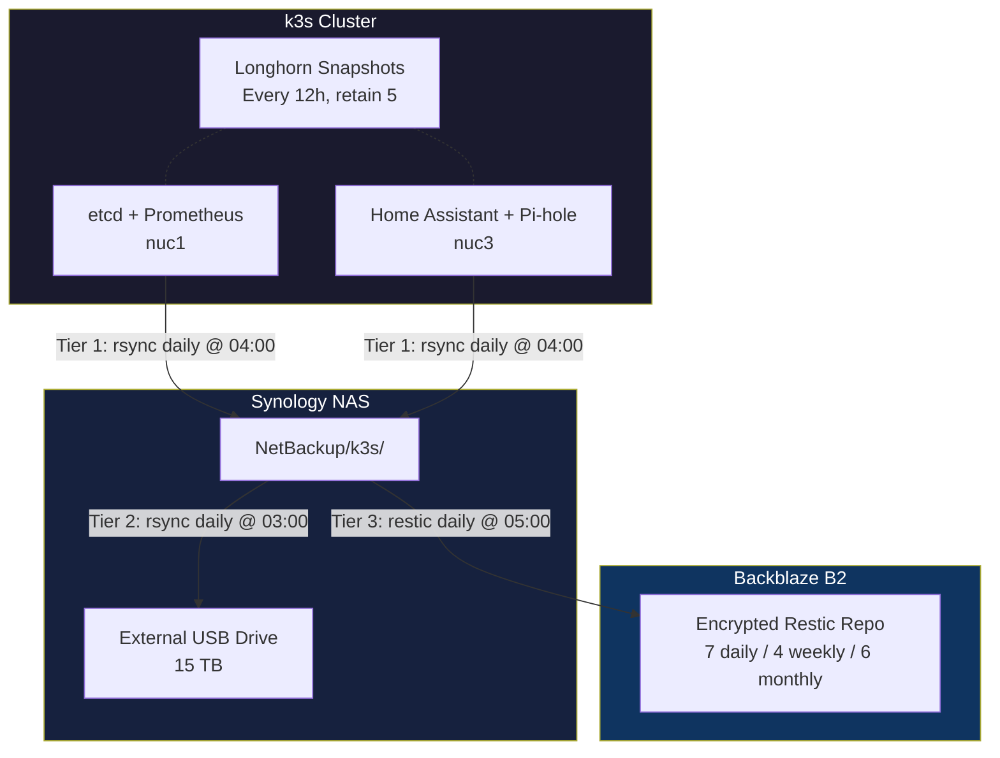

# Homelab: Production-Grade Kubernetes on Bare Metal

A fully declarative, GitOps-managed Kubernetes homelab running on bare-metal Intel NUCs. Three nodes, 10+ services, zero manual `kubectl apply` after bootstrap.

**Philosophy:** Treat a homelab like production infrastructure. Every change goes through Git. Every secret is managed externally. Every service has network policies, pod security standards, and monitoring. If a node dies, the cluster self-heals. If the repo is the source of truth, the cluster matches it — always.

**Key numbers:**
- 3-node k3s cluster (96 GB RAM, 768 GB SSD total)
- 12 ArgoCD-managed applications
- Dual Pi-hole DNS for high availability
- 3-tier automated backup pipeline (cluster → NAS → cloud)
- Internal CA with automatic wildcard TLS

## Contents

- [Network Topology](#network-topology)
- [Hardware](#hardware)
- [GitOps: ArgoCD App-of-Apps](#gitops-argocd-app-of-apps)
- [TLS Certificate Chain](#tls-certificate-chain)
- [Secrets Management](#secrets-management)
- [DNS: Dual Pi-hole HA](#dns-dual-pi-hole-ha)
- [Security](#security)
- [Observability](#observability)
- [Backup Strategy](#backup-strategy)
- [CI/CD](#cicd)
- [Operational Tooling](#operational-tooling)
- [Repository Structure](#repository-structure)
- [Services](#services)
- [Lessons Learned](#lessons-learned)
- [Known Gaps & Roadmap](#known-gaps--roadmap)

---

## Network Topology



---

## Hardware

| Role | Device | CPU | RAM | Storage | Node |
|------|--------|-----|-----|---------|------|
| Control plane + etcd | Intel NUC7i7BNH | i7-7567U | 32 GB | 256 GB SSD | `nuc1` |
| Worker | Intel NUC7i7BNH | i7-7567U | 32 GB | 256 GB SSD | `nuc2` |
| Worker | Intel NUC7i7BNH | i7-7567U | 32 GB | 256 GB SSD | `nuc3` |
| NAS / Backup target | Synology DS218+ | Celeron J3355 | 2 GB | 2x 8TB (SHR) | — |
| Network | TP-Link T1600G-28TS | — | — | — | — |

**Storage model:** All PVCs use the k3s `local-path` provisioner. Persistent volumes have node affinity — a pod using a local-path PVC can only schedule on the node where the volume was created. This is a deliberate tradeoff: local NVMe performance over portability.

---

## GitOps: ArgoCD App-of-Apps

A single `kubectl apply -f root.yaml` bootstraps the entire cluster. The root Application watches `k8s/argocd/apps/` and manages all child Applications. After that, every change flows through Git — push to `main`, ArgoCD syncs automatically.

### Sync Wave Ordering



Sync waves ensure dependencies are ready before dependents deploy. Namespaces exist before MetalLB needs its namespace. Traefik has its LoadBalancer IP before services create IngressRoutes. cert-manager CRDs exist before Certificates are created.

### Two Deployment Patterns

**Plain manifests** — Services like Pi-hole, Home Assistant, and Traefik have raw YAML in `k8s/<service>/`. ArgoCD watches the directory directly.

**Multi-source Helm** — Services like monitoring (kube-prometheus-stack), cert-manager, and Ollama use upstream Helm charts. Only `values.yaml` lives in this repo; the chart is pulled from the upstream registry at sync time.

```yaml
# Root Application — bootstraps everything
apiVersion: argoproj.io/v1alpha1
kind: Application
metadata:
  name: root
  namespace: argocd
spec:
  project: default
  source:
    repoURL: https://github.com/<user>/homelab.git
    targetRevision: main
    path: k8s/argocd/apps
  destination:
    server: https://kubernetes.default.svc
    namespace: argocd
  syncPolicy:
    automated:
      prune: true
      selfHeal: true
```

```yaml
# Multi-source Helm — monitoring example
apiVersion: argoproj.io/v1alpha1
kind: Application
metadata:
  name: monitoring
  namespace: argocd
  annotations:
    argocd.argoproj.io/sync-wave: "0"
spec:
  project: default
  sources:
    - repoURL: https://github.com/<user>/homelab.git
      targetRevision: main
      ref: values
    - repoURL: https://prometheus-community.github.io/helm-charts
      chart: kube-prometheus-stack
      targetRevision: 72.*
      helm:
        valueFiles:
          - $values/k8s/monitoring/values.yaml
  destination:
    server: https://kubernetes.default.svc
    namespace: monitoring
  syncPolicy:
    automated:
      prune: true
      selfHeal: true
    syncOptions:
      - ServerSideApply=true
```

---

## TLS Certificate Chain

All internal services get HTTPS automatically through a self-signed CA managed by cert-manager. No per-service certificate configuration required.

```mermaid
graph LR
    SI[selfsigned<br>ClusterIssuer] -->|issues| CA[homelab-ca<br>Certificate<br>ECDSA P-256, 10yr]
    CA -->|secret used by| CAI[homelab-ca<br>ClusterIssuer]
    CAI -->|issues| WC["*.lab.example.com<br>Wildcard Certificate<br>1yr, auto-renew at 30d"]
    WC -->|stored in| TLS[TLSStore<br>default cert]
    TLS -->|serves| IR[All IngressRoutes<br>tls: {}]

    style SI fill:#1b4332,color:#fff
    style CA fill:#2d6a4f,color:#fff
    style CAI fill:#40916c,color:#fff
    style WC fill:#52b788,color:#fff
    style TLS fill:#74c69d,color:#fff
    style IR fill:#95d5b2,color:#fff
```

**Why this design:**
- **One wildcard cert** covers all services — no cert-per-service overhead
- **Auto-renewal** — cert-manager renews 30 days before expiry
- **TLSStore default** — any IngressRoute with `tls: {}` gets the wildcard cert automatically
- **Private CA** — appropriate for internal-only services; no public CA fees or rate limits

---

## Secrets Management

Secrets are managed by the [External Secrets Operator](https://external-secrets.io/) (ESO) using a password manager SDK provider. Only one manual secret exists in the cluster — the service account token that bootstraps ESO itself. Everything else is declarative.

**Architecture:**

```
Password Manager Vault
        │
        ▼
ClusterSecretStore (connects via service account token)
        │
        ▼
ExternalSecret (declares which fields to sync)
        │
        ▼
Kubernetes Secret (created/updated automatically)
```

**Bootstrap process:**
1. Create the `external-secrets` namespace
2. Create a single Secret with the service account token
3. `kubectl apply -f root.yaml` — ArgoCD deploys everything, ESO syncs all secrets

After bootstrap, rotating a secret means updating it in the password manager. ESO detects the change and syncs it to the cluster automatically.

---

## DNS: Dual Pi-hole HA

Two Pi-hole instances provide redundant DNS for the entire network:

| Instance | IP | Role | Management |
|----------|-----|------|------------|
| NAS | `10.0.1.10` | DNS 1 (primary for clients) | Docker Compose |
| Cluster | `10.0.1.200` | DNS 2 (failover) | ArgoCD (GitOps) |

**Why two instances:** The NAS has fewer failure modes than the cluster (no Kubernetes scheduling, no pod eviction, no PVC node affinity issues). It's the preferred DNS server for clients. The cluster instance is the *configuration primary* — changes are made in Git, synced by ArgoCD, then replicated to the NAS every 30 minutes via [Nebula Sync](https://github.com/lovelaze/nebula-sync).

**Real-world tradeoff — IPv6 DNS bypass:** The ISP router pushes Google's public IPv6 DNS (`2001:4860:4860::8888`) via RDNSS in Router Advertisements. This is hardcoded in the router firmware and cannot be changed. Devices using DHCP may bypass Pi-hole for IPv6 DNS queries. Workaround: manually set DNS on devices that support it. This is documented as a known limitation rather than hidden.

---

## Security

### Pod Security Standards

Every namespace has [Pod Security Standards](https://kubernetes.io/docs/concepts/security/pod-security-standards/) enforced at the namespace level:

```yaml
labels:
  pod-security.kubernetes.io/enforce: baseline
  pod-security.kubernetes.io/warn: restricted
  pod-security.kubernetes.io/audit: restricted
```

Non-privileged workloads run as non-root, drop all capabilities, and use `RuntimeDefault` seccomp profiles. The monitoring namespace is the exception — it uses `privileged` enforce because node-exporter requires host access.

### Network Policies

Every service has a `networkpolicy.yaml` restricting ingress. The Pi-hole policy demonstrates the pattern — DNS is open to all clients, but the web UI is restricted to Traefik:

```yaml
apiVersion: networking.k8s.io/v1
kind: NetworkPolicy
metadata:
  name: pihole
  namespace: pihole
spec:
  podSelector:
    matchLabels:
      app: pihole
  policyTypes:
    - Ingress
    - Egress
  ingress:
    # Allow DNS from anywhere (clients on the LAN and cluster pods)
    - ports:
        - protocol: TCP
          port: 53
        - protocol: UDP
          port: 53
    # Allow web UI from Traefik only
    - from:
        - namespaceSelector:
            matchLabels:
              kubernetes.io/metadata.name: traefik
      ports:
        - protocol: TCP
          port: 80
  egress:
    # Allow DNS resolution (CoreDNS)
    - to:
        - namespaceSelector:
            matchLabels:
              kubernetes.io/metadata.name: kube-system
          podSelector:
            matchLabels:
              k8s-app: kube-dns
      ports:
        - protocol: UDP
          port: 53
        - protocol: TCP
          port: 53
    # Allow upstream DNS and HTTP/HTTPS to public internet only
    - to:
        - ipBlock:
            cidr: 0.0.0.0/0
            except:
              - 10.0.0.0/8
              - 172.16.0.0/12
              - 192.168.0.0/16
      ports:
        - protocol: UDP
          port: 53
        - protocol: TCP
          port: 53
        - protocol: TCP
          port: 80
        - protocol: TCP
          port: 443
```

### Traefik Security Headers

A global middleware applies security headers to every IngressRoute:

- HSTS with 1-year max-age, includeSubdomains, preload
- `X-Frame-Options: DENY`
- `X-Content-Type-Options: nosniff`
- `X-XSS-Protection` enabled
- `Referrer-Policy: strict-origin-when-cross-origin`

### SSH Hardening

All nodes use key-only authentication managed by a password manager SSH agent. No private key material exists on disk. Password authentication is disabled. The NAS uses a non-standard SSH port.

---

## Observability

The monitoring stack is built on **kube-prometheus-stack** (Prometheus, Grafana, Alertmanager, node-exporter) deployed via Helm.

**What's monitored:** Node health (CPU, memory, disk via node-exporter), Kubernetes state (pod status, deployment health via kube-state-metrics), application metrics (cert-manager certificate expiry, Longhorn volume health), and backup health (custom textfile collector metrics from each node).

**Custom alerts** beyond the kube-prometheus defaults:

| Alert | Condition | Severity |
|-------|-----------|----------|
| `BackupStale` | No successful backup for >26 hours | warning |
| `BackupFailed` | Last backup exited with error | critical |
| `BackupMetricMissing` | Metrics not reported for 30+ min | warning |

**SLO-like indicators:** There's no formal SLO framework, but a few signals are treated as implicit reliability targets. DNS resolution availability is covered by the dual Pi-hole setup -- if one instance goes down, clients fail over to the other. Backup freshness is monitored with a 26-hour staleness threshold, which effectively enforces a 1-day RPO target. Certificate validity is handled by cert-manager's auto-renewal 30 days before expiry; if renewal fails, kube-prometheus-stack's built-in cert-manager alerts fire. These aren't SLOs with error budgets -- they're "things that page me if they break."

**Grafana dashboards:** Custom ConfigMap-based dashboards exist for [cert-manager](../k8s/cert-manager/resources/grafana-dashboard.yaml) (certificate expiry, renewal success rates) and [Home Assistant](../k8s/homeassistant/grafana-dashboard.yaml) (entity counts, automation triggers). These supplement the kube-prometheus-stack defaults (node overview, pod resources, API server health) and are deployed via ArgoCD like everything else.

**Metrics pipeline -- textfile collector:** Backup scripts on each node write Prometheus metrics to a well-known path using an atomic write pattern (write to temp file, `mv` into place). node-exporter scrapes the `.prom` files, Prometheus evaluates alerting rules against them. This avoids the need for custom exporters or a Pushgateway -- the backup cron job just writes a file, and the existing scrape pipeline handles the rest.

---

## Backup Strategy

A 3-tier pipeline ensures data survives node failures, disk failures, and site disasters.



| Tier | Flow | Tool | Schedule | Purpose |
|------|------|------|----------|---------|
| 0 | In-cluster snapshots | Longhorn | Every 12h | Fast point-in-time recovery |
| 1 | Cluster → NAS | rsync | Daily 04:00 | Off-node copy |
| 2 | NAS → USB | rsync | Daily 03:00 | Off-disk copy |
| 3 | NAS → Backblaze B2 | restic (encrypted) | Daily 05:00 | Off-site, deduplicated |

**What's backed up:** etcd snapshots, Prometheus data, Home Assistant config, Pi-hole config, user home directories, Plex metadata.

**What's not backed up:** Ollama models (re-downloadable from upstream).

**Monitoring:** Prometheus alerts fire if backups are stale, failed, or not reporting metrics.

### Restore Runbook

A documented restore runbook (`docs/restore-runbook.md`) covers recovery procedures for each failure tier:

- **Single PVC restore** from Longhorn snapshots, NAS rsync backups, or B2 offsite (three options depending on what survived)
- **Single node rebuild** -- OS install, k3s join, PVC data restore, backup script redeployment (separate procedures for control-plane vs. worker nodes)
- **ArgoCD re-bootstrap** -- ESO bootstrap secret, repo secret, Helm install, `root.yaml` apply; all other secrets auto-sync from the password manager once ESO is running
- **Full cluster restore** -- ordered rebuild of all three nodes, ArgoCD bootstrap, PVC restore, and a verification checklist covering nodes, workloads, DNS, TLS, monitoring, and Longhorn health
- **Offsite restore from B2** -- retrieving encrypted restic snapshots when both NAS and USB backups are unavailable

The runbook documents step-by-step procedures, but end-to-end restore drills have not been run yet. This is acknowledged as a planned improvement in the [Known Gaps](#known-gaps--roadmap) section.

---

## CI/CD

| Layer | Tool | What it does |
|-------|------|-------------|
| Linting | yamllint | Validates YAML syntax and style on every PR |
| Schema validation | kubeconform | Validates manifests against Kubernetes and CRD schemas |
| Deployment | ArgoCD | Auto-syncs from `main` with `prune: true` and `selfHeal: true` |
| Dependency updates | Renovate | Pins Docker image digests, automerges patch updates, enforces version constraints |

The CI pipeline runs on PRs touching `k8s/`. ArgoCD syncs on merge to `main`. No manual deployment steps exist.

---

## Operational Tooling

**Backup scripts** (`scripts/backup/`) -- Each NUC runs a node-specific backup script daily at 04:00 that rsyncs local PVC data to the NAS. `nuc1-backup.sh` handles etcd snapshots and Prometheus data; `nuc3-backup.sh` handles Home Assistant and Pi-hole configs. The NAS then runs `restic-b2-backup.sh` at 05:00 to encrypt and push everything offsite to Backblaze B2, applying a retention policy (7 daily / 4 weekly / 6 monthly) and running a weekly integrity check on Sundays. The cascade schedule (NAS-to-USB at 03:00, NUCs-to-NAS at 04:00, NAS-to-B2 at 05:00) ensures each tier completes before the next begins. A few engineering patterns are worth highlighting: PVC paths are matched with shell globs (e.g., `"$STORAGE"/*_monitoring_prometheus-*`) rather than hardcoded, so backups survive PVC recreation where the random prefix changes. Prometheus metrics are written atomically -- each script writes to a PID-suffixed temp file and `mv`s it into the node-exporter textfile collector directory, preventing partial reads. An `ERR` trap ensures a failure metric (`nuc_backup_success{node="..."} 0`) is emitted even on unexpected errors, closing the loop with Prometheus alerts.

```bash
# Atomic metric write pattern used by all backup scripts
cat > "$METRICS_DIR/nuc_backup.$$.prom" <<PROM
nuc_backup_success{node="$NODE"} 1
nuc_backup_last_success_timestamp_seconds{node="$NODE"} $(date +%s)
PROM
mv "$METRICS_DIR/nuc_backup.$$.prom" "$METRICS_FILE"
```

**Home Assistant discovery MCP server** (`tools/ha-discovery/`) -- A custom [Model Context Protocol](https://modelcontextprotocol.io/) server written in Python that lets an AI assistant discover and configure new devices on a Home Assistant instance. The server wraps the HA REST and WebSocket APIs using an async `aiohttp` client, exposing six tools via [FastMCP](https://github.com/jlowin/fastmcp): `list_discovered_devices`, `list_configured_integrations`, `start_config_flow`, `get_flow_step`, `advance_flow`, `abort_flow`, and `ignore_discovery`. Authentication tokens are resolved at runtime from an environment variable or a password manager CLI call, with a single-call cache to avoid repeated lookups. Zero-config devices (those with an empty form schema) can be auto-accepted by submitting `{}`; devices requiring credentials prompt the user through the assistant. This turns device onboarding from a manual web UI workflow into a conversational one.

---

## Repository Structure

```
homelab/
├── .github/workflows/
│   └── validate.yaml          # CI: yamllint + kubeconform
├── k8s/
│   ├── namespaces.yaml        # Shared namespaces
│   ├── argocd/
│   │   ├── apps/              # ArgoCD Application manifests
│   │   │   ├── root.yaml      # Bootstrap app-of-apps
│   │   │   ├── monitoring.yaml
│   │   │   ├── pihole.yaml
│   │   │   └── ...            # 14 more Application YAMLs
│   │   ├── values.yaml        # ArgoCD Helm values
│   │   └── ingress.yaml
│   ├── cert-manager/
│   │   ├── values.yaml        # Helm values
│   │   └── resources/         # CA chain, wildcard cert, TLSStore
│   ├── external-secrets/
│   │   ├── values.yaml
│   │   └── resources/         # ClusterSecretStore, ExternalSecrets
│   ├── homeassistant/         # Deployment, PVC, IngressRoute
│   ├── longhorn/              # Longhorn config + recurring snapshots
│   ├── metallb/               # IPAddressPool, L2Advertisement
│   ├── monitoring/            # kube-prometheus-stack values, ingress
│   ├── ollama/                # Helm values, network policy
│   ├── pihole/                # Deployment, DNS config, ExternalSecret
│   ├── tailscale/             # Deployment, ExternalSecret
│   └── traefik/               # Deployment, security headers, TLS
├── nas/
│   └── pihole/                # Docker Compose for NAS Pi-hole replica
├── scripts/
│   └── backup/                # Backup scripts (rsync, restic)
├── docs/                      # Operational runbooks and plans
└── renovate.json              # Dependency update configuration
```

---

## Services

| Service | Type | Description |
|---------|------|-------------|
| [ArgoCD](https://argo-cd.readthedocs.io/) | Helm | GitOps continuous delivery |
| [cert-manager](https://cert-manager.io/) | Helm | TLS certificate automation (internal CA) |
| [External Secrets](https://external-secrets.io/) | Helm | Sync secrets from password manager |
| [Home Assistant](https://www.home-assistant.io/) | Manifests | Home automation |
| [Longhorn](https://longhorn.io/) | Helm | Distributed block storage + volume snapshots |
| [MetalLB](https://metallb.io/) | Manifests | Bare-metal load balancer (L2 mode) |
| [kube-prometheus-stack](https://github.com/prometheus-community/helm-charts) | Helm | Monitoring (Prometheus + Grafana + Alertmanager) |
| [Ollama](https://ollama.com/) | Helm | Local LLM inference |
| [Pi-hole](https://pi-hole.net/) | Manifests | DNS ad-blocking (cluster instance) |
| [Tailscale](https://tailscale.com/) | Manifests | Mesh VPN for remote access |
| [Traefik](https://traefik.io/) | Manifests | Ingress controller with automatic TLS |

---

## Lessons Learned

A few real-world tradeoffs worth documenting:

- **Local-path storage is a sharp edge.** PVCs are pinned to nodes. If a node goes down, pods with PVCs on that node stay Pending until it comes back. The simplicity is worth it for a 3-node cluster, but you must plan around it.
- **ISP hardware fights you.** The ISP router pushes its own IPv6 DNS servers via Router Advertisements, bypassing Pi-hole. You can't change this on consumer ISP hardware. Document the limitation and move on.
- **Helm + GitOps needs multi-source.** ArgoCD's multi-source feature lets you keep only `values.yaml` in your repo while pulling charts from upstream. This keeps the repo clean but adds complexity to Application manifests.
- **Dual Pi-hole is worth the effort.** DNS is the one service where downtime is immediately and painfully visible to every user on the network. Two instances with sync is cheap insurance.
- **Backup monitoring matters more than backups.** A backup that silently fails for weeks is worse than no backup. Prometheus alerts on stale/failed backups close the loop.

---

## Known Gaps & Roadmap

Infrastructure is never finished. These are the gaps I'm aware of and plan to address:

### Control Plane HA

The cluster runs a single control plane node. If `nuc1` goes down, the API server is unavailable and no new scheduling happens (existing workloads on `nuc2`/`nuc3` continue running). A proper HA setup would use 3 server nodes with embedded etcd consensus across all three. The tradeoff today: dedicating two worker nodes to also run control plane components reduces available capacity on a small cluster. Worth revisiting if a fourth node is added.

### Restore Drills

The 3-tier backup pipeline is monitored and automated, but restores haven't been validated end-to-end in a documented drill. The plan:

- [ ] Restore etcd snapshot to a throwaway k3s instance and verify cluster state
- [ ] Restore Home Assistant and Pi-hole configs from NAS backup to fresh PVCs
- [ ] Restore from Backblaze B2 (restic) to verify encryption keys and repo integrity
- [ ] Document results and make it a quarterly exercise

### Policy Enforcement

Pod Security Standards are enforced at the namespace level, but there's no admission policy engine (OPA/Gatekeeper or Kyverno) for fine-grained rules like requiring resource limits, blocking `latest` tags, or enforcing label conventions. Adding Kyverno with a baseline policy set would catch misconfigurations before they reach the cluster.

### CD Testing Beyond Lint

CI validates YAML syntax (yamllint) and schema correctness (kubeconform), but there's no dry-run or diff preview. Planned improvements:

- [ ] ArgoCD diff comments on PRs (show what would change before merge)
- [ ] `kubeval`/`kubeconform` with full CRD schemas (currently skips ArgoCD, ESO CRDs)
- [ ] Conftest or Kyverno CLI for policy-as-code checks in CI

### Structured Alerting

Prometheus alerts exist for backup health, but there's no alert routing, escalation, or on-call structure. Alertmanager routes everything to a single receiver. A more complete setup would add severity-based routing, PagerDuty/Slack integration, and silencing rules for planned maintenance windows.
